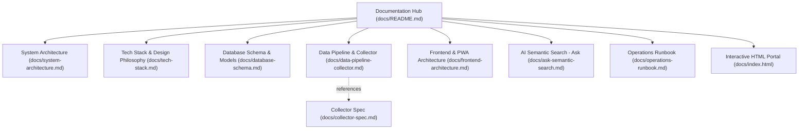
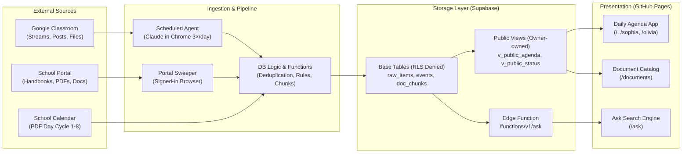

# Kids Classroom Reminders · Documentation Hub

Welcome to the comprehensive technical documentation for **Kids Classroom Reminders** (also known as *School Day*).

Kids Classroom Reminders is a zero-build, kid-friendly daily calendar, reminder, and conversational search system built for two Lauremont School students (Sophia and Olivia) and their parents. It automatically extracts, reconciles, and presents information from Google Classroom streams, school portal documents, recurring class timetables, and the official school calendar.

---

## 🗺️ Documentation Map

The documentation is divided into specialized guides covering different layers and use cases of the project:

| Guide | Description | Target Audience |
|---|---|---|
| [System Architecture](system-architecture.md) | High-level system design, C4 context/container diagrams, data flow lifecycles, and security/trust boundaries. | Architects, Engineers, New Contributors |
| [Tech Stack & Design Philosophy](tech-stack.md) | Technical stack breakdown, library-free frontend rationale, PWA design, Supabase integration, and trade-offs. | Full-Stack Developers |
| [Database Schema & Models](database-schema.md) | Comprehensive PostgreSQL data model, ER diagrams, stored procedures, RLS policies, and public view contracts. | Database Engineers, Backend Developers |
| [Data Pipeline & Collector](data-pipeline-collector.md) | Scheduled AI browser ingestion (Claude in Chrome), attachment OCR, deduplication triad, deletion reconciliation, and OAuth fallback. | Data Engineers, Pipeline Maintainers |
| [Frontend & PWA Architecture](frontend-architecture.md) | Vanilla JS architecture, route isolation (`/`, `/sophia`, `/olivia`, `/ask`, `/documents`), Add-to-Home-Screen engine (`a2hs.js`), and asset versioning. | Frontend Developers, UI/UX Designers |
| [AI Semantic Search ("Ask")](ask-semantic-search.md) | Conversational QA engine, hybrid retrieval architecture (calendar arithmetic vs. vector search), prompt fencing, and slash commands. | AI/LLM Engineers |
| [Operations Runbook](operations-runbook.md) | Step-by-step guides for deployment, DNS/SSL setup, freshness monitoring, review queue moderation, and annual calendar rollover. | Site Reliability Engineers, Operators, Parents |
| [Interactive HTML Portal](index.html) | Standalone interactive documentation dashboard with live Mermaid.js diagrams, search, and collapsible sections. | All Readers (Visual Exploration) |
| [Collector Specification](collector-spec.md) | The strict database and extraction contract followed by the scheduled scraping agent. | Scraper Agents & Automation Tasks |

---

## ⚡ High-Level System Overview

---

## 🧭 Reading Guide by Persona

- **If you want to understand how the whole system works end-to-end**: Start with [System Architecture](system-architecture.md) and [Tech Stack](tech-stack.md).
- **If you are maintaining or updating the scraper/collector**: Read [Data Pipeline & Collector](data-pipeline-collector.md) alongside the existing [Collector Specification](collector-spec.md).
- **If you are working on the UI or mobile experience**: Read [Frontend & PWA Architecture](frontend-architecture.md).
- **If you want to understand the AI question-answering system**: Read [AI Semantic Search ("Ask")](ask-semantic-search.md).
- **If you need to deploy or resolve a missed sync**: Check the [Operations Runbook](operations-runbook.md).
