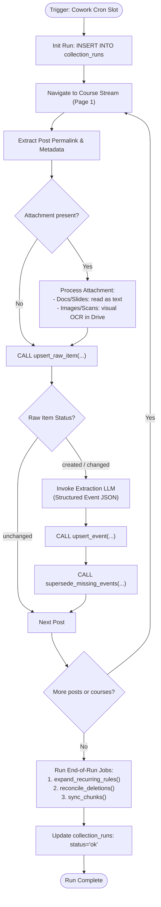
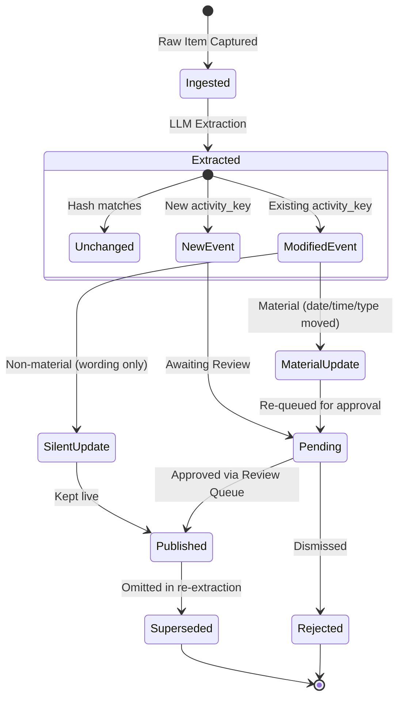

# Data Ingestion & Extraction Pipeline

This document details the automated ingestion pipeline that monitors Google Classroom streams and the school portal, extracts structured school events, and safely reconciles updates and deletions.

---

## 1. Pipeline Context: Why Automated Browser Scraping?

While Google provides an official Google Classroom REST API, institutional Google Workspace for Education domains can restrict third-party API clients. Lauremont School enforces strict administrative policies: unapproved OAuth clients return `access_not_configured`.

To achieve seamless data capture without waiting for administrative approval, the system employs an automated browser collector (**Claude in Chrome**) operating under the students' authenticated Chrome profiles (`u/1` for Sophia, `u/2` for Olivia).

An OAuth probe is maintained in standby under `oauth/` should administrative policy change in the future (see [Section 6](#6-standby-oauth-probe)).

---

## 2. Ingestion Lifecycle & Flowchart

The collector executes three times daily (6:00 AM, 4:00 PM, 8:00 PM America/Toronto time).



---

## 3. Post Identity & Attachment Extraction

### 1. The Identity Triad
To prevent duplicates across scrapes and maintain history when teachers edit posts, every Classroom item is tracked using three orthogonal concepts:

| Dimension | Column | When it changes | Purpose |
|---|---|---|---|
| **Identity** | `raw_items.source_key` | **Never** | Unique ID from post permalink (`/c/<course>/a/<POSTID>/details` or `/p/<POSTID>`). |
| **Version** | `raw_items.content_hash` | When content is edited | SHA-256 hash of `kind + title + body + attachments`. |
| **Liveness** | `last_seen_at` / `missing_runs` | When post disappears | Tracks whether the post remains visible in the active stream. |

### 2. Attachment Parsing & Multimodal OCR
Attachments often carry the most important schedule information (e.g. syllabus slides, tournament schedules, "Meet the Teacher" infographic posters).

- **Google Docs, Sheets, Slides, Text PDFs**: Extracted directly as plain text.
- **Image Attachments (PNG/JPG) & Scanned PDFs**: The scraper opens the image in Google Drive, takes a high-resolution screenshot, and uses multimodal vision to extract all textual information into `extracted_text`.
- **Integrity Rule**: Placeholders such as `"(image not read)"` are strictly forbidden. If an attachment cannot be parsed, an empty string `""` is stored, and the system re-attempts extraction on the subsequent run.

---

## 4. Structured Extraction Contract

When a new or modified post is detected, the raw text is provided to the extraction model. The model must produce a JSON array adhering to this schema:

```json
[
  {
    "activity_key": "cross-country-meet-1",
    "event_date": "2026-09-18",
    "cycle_day": null,
    "start_time": "13:30",
    "end_time": "16:00",
    "type": "practice",
    "kid_title": "Cross country meet #1",
    "icon": "🏃",
    "parent_detail": "Meet at Boyd Conservation Area. Bring water bottle and running shoes.",
    "confidence": 0.95
  }
]
```

### Extraction Guidelines
1. **Stable `activity_key`**: Must identify the *event itself*, never the date. For example, use `"math-quiz-ch2"`, not `"math-quiz-sept15"`. This ensures that if the teacher moves the quiz, the system treats it as an update rather than creating a duplicate.
2. **Kid Voice `kid_title`**: Concise (under 6 words), active phrasing understandable by an 8-year-old (e.g. `"Bring your library book"`).
3. **Cycle Day Fallback**: If a teacher writes *"Day 3: Bring indoor shoes"*, `event_date` is emitted as `null`, and `"cycle_day": 3` is populated. The database resolves this to a concrete calendar date using `day_cycle`.
4. **Allowed Event Types**: `due`, `bring`, `test`, `tryout`, `practice`, `form`, `gym`, `trip`, `info`.
5. **No-Op Filter**: Non-actionable informational announcements without deadlines or events emit an empty array `[]`.

---

## 5. Event Deduplication, Materiality & Reconciliation

### Event State Lifecycle



### Material vs. Non-Material Changes
When `upsert_event()` is called:
- **Non-Material Change**: A minor spelling correction or updated link updates the record silently while preserving `status = 'published'`.
- **Material Change**: If `event_date`, `start_time`, `end_time`, or `type` is modified, the event flips to `status = 'pending'`, sets `needs_review = true`, and enters `v_review_queue`. This prevents rescheduled tests from surprising students before parents have verified the change.

### Deletion Guard (`reconcile_deletions`)
Google Classroom streams lazy-load items asynchronously. If a web page load stutters, posts may momentarily be missing from the DOM.
- The scraper registers `class_scans` with an explicit `ok = true` only when the DOM successfully completed rendering.
- `reconcile_deletions()` requires a post to be missing for **two consecutive valid scans** before marking it as deleted.

---

## 6. Standby OAuth Probe

In `oauth/`, a lightweight Python utility (`classroom_probe.py`) is preserved for direct Google Classroom API calls if the school domain ever grants API access:

- **GCP Project**: `kids-classroom-reminders`
- **OAuth Client ID**: `321996577488-lh8hlhge8aq53duasm479t27ibobm9ln.apps.googleusercontent.com`
- **Required Read Scopes**:
  - `https://www.googleapis.com/auth/classroom.courses.readonly`
  - `https://www.googleapis.com/auth/classroom.announcements.readonly`
  - `https://www.googleapis.com/auth/classroom.coursework.me.readonly`
  - `https://www.googleapis.com/auth/classroom.courseworkmaterials.readonly`

To test domain accessibility:
```bash
cd oauth
pip3 install google-auth-oauthlib google-api-python-client
python3 classroom_probe.py grade6
```
If the domain is allowlisted, the script produces `raw_grade6.json` and outputs all course streams with direct permalinks.
