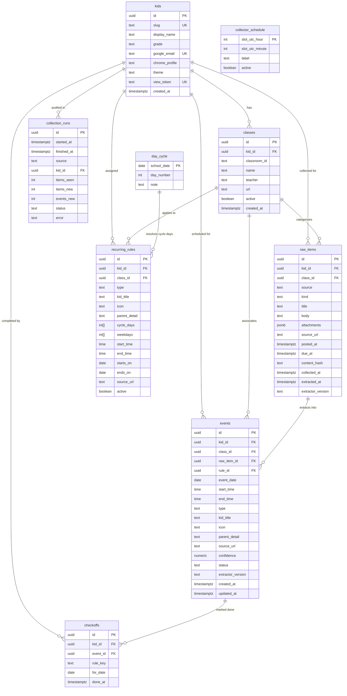

# Database Schema & Data Models

Kids Classroom Reminders runs on PostgreSQL (hosted via Supabase). The schema balances strict relational integrity for classroom events with flexible JSONB storage for document attachments and semantic chunking for AI retrieval.

---

## 1. Entity-Relationship Diagram (ERD)



---

## 2. Table Data Dictionary

### `kids`
Defines student profiles, styling preferences, and private security tokens.
- `id` (`uuid`, PK): Default `gen_random_uuid()`.
- `slug` (`text`, Unique, Not Null): URL identifier (e.g. `'sophia'`, `'olivia'`).
- `display_name` (`text`, Not Null): UI name (e.g. `'Sophia'`, `'Olivia'`).
- `grade` (`text`): Academic year (e.g. `'6'`, `'3'`). Used to sort descending.
- `google_email` (`text`, Unique): Student's Google Workspace account email.
- `chrome_profile` (`text`): Profile identifier for scraper session (`'u/1'`, `'u/2'`).
- `theme` (`text`, Default `'blue'`): Kid accent theme (`'violet'`, `'teal'`, `'amber'`, `'rose'`).
- `view_token` (`text`, Unique, Not Null): Secret access token for scoped URLs.

### `classes`
Google Classroom courses associated with each kid.
- `id` (`uuid`, PK): Internal unique identifier.
- `kid_id` (`uuid`, FK -> `kids.id`): Student enrolled.
- `classroom_id` (`text`): Google Classroom course ID when known.
- `name` (`text`, Not Null): Display course name (e.g. `'Class 318 (2026/2027)'`).
- `teacher` (`text`): Teacher name (e.g. `'Mrs. Hutchinson'`).
- `url` (`text`): Direct URL to the course stream.
- `active` (`boolean`, Default `true`): Whether the class is actively scanned.

### `raw_items`
Immutable capture of raw posts, assignments, and materials collected from Classroom.
- `id` (`uuid`, PK): Internal unique identifier.
- `kid_id` (`uuid`, FK -> `kids.id`): Student for whom this item was found.
- `class_id` (`uuid`, FK -> `classes.id`): Source course.
- `source` (`text`, Default `'cowork-chrome'`): Collector source (`'cowork-chrome'`, `'classroom-api'`).
- `kind` (`text`, Not Null): `'announcement'` | `'assignment'` | `'material'`.
- `title` (`text`): Title of the post or assignment.
- `body` (`text`): Unprocessed post content text.
- `attachments` (`jsonb`, Default `'[]'`): Structured attachment array:
  `[{"title": "...", "type": "slides", "url": "...", "extracted_text": "..."}]`
- `source_url` (`text`): Direct permalink to the post.
- `posted_at` (`timestamptz`): Publication timestamp from Google Classroom.
- `due_at` (`timestamptz`): Assignment due timestamp if applicable.
- `content_hash` (`text`, Not Null): SHA-256 fingerprint of `(kind | title | body | attachments)`.
- `collected_at` (`timestamptz`, Default `now()`): Ingestion timestamp.
- `extracted_at` (`timestamptz`): Timestamp when LLM successfully extracted events.
- `extractor_version` (`text`): Model/prompt version used for extraction.
- **Constraints**: Unique `(kid_id, content_hash)` ensures idempotent runs.

### `events`
The primary deliverable: individual, actionable schedule entries presented to the kids.
- `id` (`uuid`, PK): Internal event ID.
- `kid_id` (`uuid`, FK -> `kids.id`): Child this event applies to.
- `class_id` (`uuid`, FK -> `classes.id`): Course association.
- `raw_item_id` (`uuid`, FK -> `raw_items.id`): Originating raw item (null if rule-generated).
- `rule_id` (`uuid`): Originating recurring rule (if generated by timetable rule).
- `event_date` (`date`, Not Null): Calendar date when the event occurs.
- `start_time` (`time`), `end_time` (`time`): Optional event time window.
- `type` (`text`, Not Null): Category (`due`, `bring`, `test`, `tryout`, `practice`, `form`, `gym`, `trip`, `info`).
- `kid_title` (`text`, Not Null): Plain, 5-6 word instruction in kid-friendly phrasing.
- `icon` (`text`): Emoji representing the activity (e.g. `🎒`, `🏀`, `📝`).
- `parent_detail` (`text`): Extended explanation for parents.
- `source_url` (`text`): Link back to original classroom post.
- `confidence` (`numeric(3,2)`, Default `1.00`): Model confidence score (< 0.70 flags review).
- `status` (`text`, Default `'pending'`): State: `'pending'`, `'published'`, `'rejected'`.
- `extractor_version` (`text`): Prompt version.
- `created_at` (`timestamptz`), `updated_at` (`timestamptz`).

### `day_cycle`
The school timetable engine. Maps real dates to the Lauremont 8-day cycle.
- `school_date` (`date`, PK): The calendar date.
- `day_number` (`int`): `1` through `8`. If `NULL`, indicates no school.
- `note` (`text`): Reason for closure (e.g. `"Labour Day (school closed)"`, `"PA Day"`).

### `recurring_rules`
Timetable rules for recurring events (e.g., Gym every Day 2 & Day 6).
- `id` (`uuid`, PK): Internal ID.
- `kid_id` (`uuid`, FK -> `kids.id`): Student.
- `type` (`text`): Event type (`gym`, `library`, `french`, etc.).
- `kid_title` (`text`), `icon` (`text`), `parent_detail` (`text`).
- `cycle_days` (`int[]`): Array of cycle day numbers (e.g. `'{1,4,7}'`).
- `weekdays` (`int[]`): Fallback weekday numbers (`1`=Monday .. `5`=Friday).
- `starts_on` (`date`), `ends_on` (`date`): Validity window for the academic term.
- `active` (`boolean`, Default `true`).

### `collection_runs` & `collector_schedule`
Operational audit trail and schedule tracking.
- `collection_runs`: Records start/finish times, status (`'running'`, `'ok'`, `'error'`), items seen, new events extracted, and error text.
- `collector_schedule`: Stores intended UTC hours/minutes (`10:00`, `20:00`, `00:00` UTC = `6am`, `4pm`, `8pm` EDT) for comparison against actual execution times.

---

## 3. Row Level Security & Public Read Surface

### Security Boundary Principle
Every base table has Row Level Security enabled with **zero anonymous policies**:
```sql
ALTER TABLE kids            ENABLE ROW LEVEL SECURITY;
ALTER TABLE classes         ENABLE ROW LEVEL SECURITY;
ALTER TABLE raw_items       ENABLE ROW LEVEL SECURITY;
ALTER TABLE events          ENABLE ROW LEVEL SECURITY;
ALTER TABLE day_cycle       ENABLE ROW LEVEL SECURITY;
ALTER TABLE recurring_rules ENABLE ROW LEVEL SECURITY;
ALTER TABLE collection_runs ENABLE ROW LEVEL SECURITY;
```
The anonymous API key (`SUPABASE_ANON_KEY`) has no direct table read or write privileges.

### Public Owner-Owned Views
The client accesses data exclusively through security-definer / owner-owned views granted to `anon`:

| View Name | Data Returned | Security Protections |
|---|---|---|
| `v_public_kids` | `slug`, `display_name`, `grade`, `theme` | Strips `view_token`, `google_email`, and `chrome_profile`. |
| `v_public_agenda` | Published events between `-7` and `+120` days | Filters `status = 'published'`, `superseded_at IS NULL`. |
| `v_public_school_events` | School-wide calendar events | Strips internal notes, exposes public calendar entries. |
| `v_public_day_cycle` | `school_date`, `day_number`, `note` | Unrestricted read of school day numbers. |
| `v_public_status` | Freshness summary (`last_success_at`, `next_scheduled_at`, `on_schedule`) | Expands schedule inline to guarantee caller security compliance. |
| `v_public_sync_log` | Slots vs. actual executions for last 3 days + next 36h | Summarizes audit logs with outcome counts (`X new, Y updated`). |
| `v_public_portal_docs` | Document metadata, chunks, indexed status | Strips full text; shows title, container, applies_to, status. |
| `v_public_portal_runs` | Portal crawler run timestamps and status | Muted operational log. |

---

## 4. Stored Procedures & Business Functions

To ensure data integrity regardless of scraper restarts or LLM retries, core transformations are executed as PostgreSQL functions:

### `upsert_raw_item(...)`
- Computes `content_hash` via `encode(digest(...), 'hex')`.
- If post does not exist: inserts with `revision = 1` and returns `out_action = 'created'`.
- If post exists and hash matches: updates `last_seen_at` and returns `out_action = 'unchanged'`.
- If post exists and hash changed: archives previous record to `raw_item_versions`, bumps revision, sets `last_changed_at = now()`, and returns `out_action = 'changed'`.

### `upsert_event(...)`
- Matches event by `p_dedupe_key` (`raw_item_id || ':' || activity_key`).
- Compares new `event_date`, `start_time`, `end_time`, and `type` against current record.
- **Materiality Check**: If date/time/type shifted, marks `out_material = true`, sets `status = 'pending'` and `needs_review = true`. If wording changed without date shifts, updates silently.

### `supersede_missing_events(raw_item_id, current_keys[], run_id)`
- Sets `superseded_at = now()` on any previously extracted event for this post whose dedupe key was omitted in the latest extraction.

### `expand_recurring_rules()`
- Idempotent procedure. Iterates active `recurring_rules`, queries `day_cycle` for matching cycle days or weekdays across the next 60 days, and inserts corresponding `events` rows tagged with `rule_id`.

### `reconcile_deletions(run_id)`
- Prevents premature event deletion due to lazy-loaded web pages.
- Requires a course to be confirmed as successfully scanned (`ok = true`) in **two consecutive runs** before marking missing posts as deleted.

### `sync_chunks()`
- Aggregates posts, attachment texts, rules, and school events into `doc_chunks`.
- Assigns validity intervals (`valid_from`, `valid_to`) to enable time-bounded vector and keyword retrieval.

---

## 5. Indexing & Optimization Strategy

```sql
-- Fast lookup of published events for the kid agenda horizon
CREATE INDEX IF NOT EXISTS events_kid_date_idx 
    ON events (kid_id, event_date) 
    WHERE status = 'published';

-- Fast review queue lookup for pending / changed items
CREATE INDEX IF NOT EXISTS events_review_idx 
    ON events (status, created_at);

-- Partial index for unextracted raw items needing LLM processing
CREATE INDEX IF NOT EXISTS raw_items_pending_idx 
    ON raw_items (kid_id) 
    WHERE extracted_at IS NULL;
```
These partial indexes ensure query execution plans remain sub-millisecond even as historical raw item and event archives grow over the school year.
