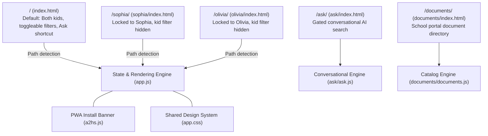
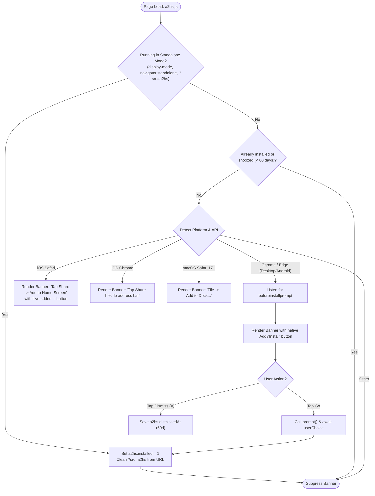
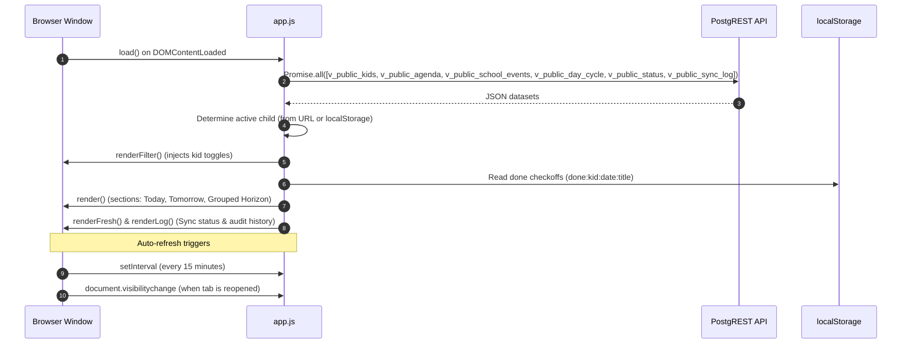

# Frontend Architecture & PWA

The Kids Classroom Reminders frontend is a zero-build, responsive Progressive Web Application (PWA) built with vanilla ES6+ JavaScript and modern CSS3. It is designed for near-instant loading, kid-friendly interactions, and frictionless installation on mobile devices.

---

## 1. Route Topology & Page Hierarchy

The client application consists of five lightweight HTML entrypoints sharing a common design system:



### Route Behavior Matrix

| Route | Intended User | Path Resolution | Header Actions | Filter Controls |
|---|---|---|---|---|
| `/` | Parents & Shared Devices | Evaluates `localStorage("filter")` | Shows **Ask** button + Today + Day Cycle pill | Toggles for Sophia, Olivia, and School Events |
| `/sophia/` | Sophia | Locks to `slug = 'sophia'` | Student greeting ("Hi Sophia"), no Ask button | Hidden (locked to single kid) |
| `/olivia/` | Olivia | Locks to `slug = 'olivia'` | Student greeting ("Hi Olivia"), no Ask button | Hidden (locked to single kid) |
| `/ask/` | Parents | N/A | Back to `/`, New conversation, Documents, Forget key | Filter buttons: Everyone, Sophia, Olivia |
| `/documents/` | Parents | N/A | Back to `/`, Document counters, Sweep timestamp | Scope buttons (All, Sophia, Olivia), Show Out-of-Scope toggle |

---

## 2. Progressive Web App (PWA) & Add-to-Home-Screen Engine (`a2hs.js`)

Installing web apps as home-screen icons provides students with a native-app experience without app store distribution overhead. Because browser APIs for home-screen installation vary wildly across operating systems, `a2hs.js` implements a custom, cross-platform lifecycle manager:



### Key Technical Details:
- **Pass-Through Service Worker (`sw.js`)**: Registers a no-op service worker to satisfy Android Chrome PWA installability requirements while intentionally caching zero network assets to prevent stale code bugs.
- **Dynamic Theming**: The banner identifies the active route (`/sophia` vs `/olivia`) and applies the corresponding kid accent color immediately before the main application data finishes loading.

---

## 3. UI Component Architecture & Rendering Cycle (`app.js`)



### Core Components
1. **Interactive Day Heading (`dayHeading`)**: Renders day name, short date, and the official school cycle badge (e.g. `Day 3` or `No school - Labour Day`).
2. **Actionable Event Card (`card`)**:
   - Emoji badge representing activity category (`🎒`, `📝`, `👟`, `🚌`).
   - Action title (under 6 words).
   - Timestamp and kid name pill (when multiple kids are visible).
   - **Checkoff Button (`.tick`)**: Allows the student to mark an item complete. Toggles the `.done` class and saves the state to `localStorage`.
   - **Expandable Detail Drawer (`.detail`)**: Clicking anywhere on the card toggles an accordion revealing parent details, class name, and the Google Classroom source link.
3. **Interactive Filter Pills (`.toggle`)**:
   - Each kid has a dedicated toggle styled with their specific accent color (`violet`, `teal`, `amber`, `rose`).
   - **Protection against empty state**: If a user attempts to uncheck the last remaining child, the toggle cancels the change and triggers a playful CSS shake animation (`.nope`).
4. **Sync Freshness & Log Drawer (`renderFresh` & `renderLog`)**:
   - The footer displays a subtle freshness indicator ("Synced 2 hours ago") with a colored pip (green for on-schedule, amber for missed or delayed runs).
   - Tapping the indicator opens an expandable log showing the next scheduled slot and the outcome of the last 12 scraper runs (`3 new, 1 updated`, `didn't run`, or specific error messages).

---

## 4. Client-Side State & Storage Architecture

The application requires no user database login for daily browsing. All personalization is persisted on the local device:

| Storage Key | Type | Stored Value | Lifecycle |
|---|---|---|---|
| `filter` | `string` | Comma-separated slugs (e.g. `"sophia,olivia"`) | Persists across sessions on `/` |
| `school` | `string` | `"1"` or `"0"` | Toggles school calendar visibility |
| `done:<kid>:<date>:<title>` | `string` | `"1"` | Student checkoff state (device-specific) |
| `a2hs.installed` | `string` | `"1"` | Permanently silences PWA banner |
| `a2hs.dismissedAt` | `string` | Millisecond timestamp | Snoozes PWA banner for 60 days |
| `askToken` | `string` | Secret alphanumeric string | Device access key for `/ask/` |

---

## 5. CSS Theming & Design System

The visual design system is implemented in `app.css` using CSS custom properties with responsive typography and native dark mode support:

```css
:root {
  --bg: #f7f5f2;
  --card: #ffffff;
  --ink: #1c1a17;
  --muted: #6b6560;
  --line: #e6e1da;
  --radius: 18px;
  --shadow: 0 1px 2px rgba(20,14,8,.05), 0 6px 20px rgba(20,14,8,.05);

  /* Kid identity accents */
  --k-violet: #5b21b6; --k-violet-soft: #ede9fe;
  --k-teal:   #0f766e; --k-teal-soft:   #ccfbf1;
  --k-amber:  #b45309; --k-amber-soft:  #fef3c7;
  --k-rose:   #be123c; --k-rose-soft:   #ffe4e6;
}

/* Dynamic kid scoping */
:root[data-kid="sophia"] { --accent: var(--k-violet); --accent-soft: var(--k-violet-soft); }
:root[data-kid="olivia"] { --accent: var(--k-teal);   --accent-soft: var(--k-teal-soft); }
:root[data-kid="both"]   { --accent: var(--k-amber);  --accent-soft: var(--k-amber-soft); }
```

### Design Highlights:
- **Apple Safe Area Insets**: `padding: env(safe-area-inset-top) ... env(safe-area-inset-bottom)` ensures UI elements never clash with the iPhone notch, dynamic island, or home indicator.
- **Micro-Interactions**: Smooth CSS transitions on card expansion, toggle selections, and checkoff state changes.
