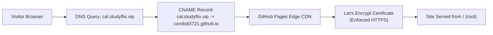
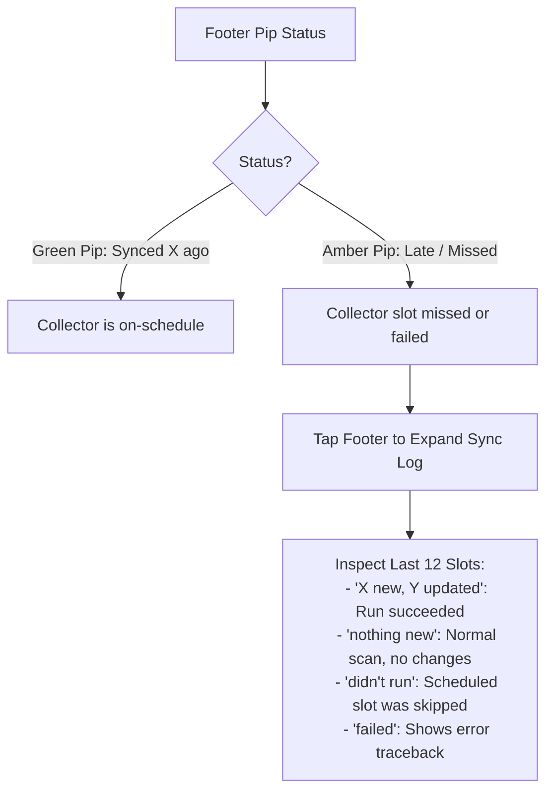
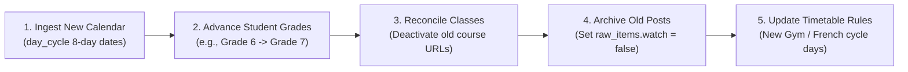

# Operations & Maintenance Runbook

This runbook provides actionable procedures for deploying, monitoring, operating, and maintaining Kids Classroom Reminders throughout the academic year.

---

## 1. Deployment & Hosting Setup

The application runs on GitHub Pages with zero build dependencies.

### Initial Deployment to GitHub Pages
1. Push repository changes to GitHub:
   ```bash
   git remote add origin git@github.com:candoit3721/kids-classroom-reminders.git
   git push -u origin main
   ```
2. Navigate to **Repository Settings** → **Pages**.
3. Under **Build and deployment**:
   - **Source**: `Deploy from a branch`
   - **Branch**: `main`
   - **Folder**: `/ (root)`
4. Click **Save**. The application will be deployed within 60 seconds.

### Custom Domain & HTTPS Setup
The project serves on `cal.studyflix.vip`.



> [!IMPORTANT]
> **DNS Configuration Requirement**: While a wildcard record `*.studyflix.vip` may resolve IP addresses, **Let's Encrypt will not issue a certificate through a wildcard**. You must create an explicit CNAME record:
>
> | Type | Host / Name | Value / Target | TTL |
> |---|---|---|---|
> | `CNAME` | `cal` (or `cal.studyflix.vip`) | `candoit3721.github.io` | Automatic / 300 |
>
> If certificate provisioning stalls, remove `cal.studyflix.vip` in GitHub Pages settings, save, re-enter it, and verify **Enforce HTTPS** is ticked.

---

## 2. Asset Versioning & Pre-Commit Hook

GitHub Pages serves assets with aggressive caching headers. To guarantee that updates to CSS or JavaScript files are immediately fetched by client browsers, the repository includes a pre-commit hook (`.githooks/pre-commit`).

### Activating the Hook (One-Time Setup per Clone)
```bash
git config core.hooksPath .githooks
```

### How the Hook Operates
- Whenever a commit touches any of the tracked assets (`app.css`, `app.js`, `a2hs.js`, `ask.css`, `ask.js`, `documents.css`, `documents.js`), the hook computes a SHA-256 hash of their staged content.
- It automatically updates the `?v=<hash>` parameter across all five HTML files (`index.html`, `sophia/index.html`, `olivia/index.html`, `ask/index.html`, `documents/index.html`) and stages them into the commit.
- **Safety Guard**: If an HTML file has *unstaged* modifications, the hook halts the commit to prevent accidentally committing unreviewed work.

---

## 3. Freshness Monitoring & Sync Auditing

The client application includes an integrated monitoring interface in the footer.



### Collector Cron Schedule
The scraper schedule is registered in PostgreSQL table `collector_schedule`:
- `10:00 UTC` = **6:00 AM EDT** (Morning check before school)
- `20:00 UTC` = **4:00 PM EDT** (After-school check for new homework/posts)
- `00:00 UTC` = **8:00 PM EDT** (Evening check for next-day preparations)

> [!NOTE]
> **Timezone Drift**: The cron runs on fixed UTC hours. During Eastern Daylight Time (EDT, UTC-4), runs occur at 6am / 4pm / 8pm. Following the November daylight saving change (EST, UTC-5), runs shift to 5am / 3pm / 7pm local time.

---

## 4. Review Queue Moderation

New and materially-changed events are held in `status = 'pending'` so parents can review rescheduled tests or due dates before they appear on the students' cards.

### Inspecting the Review Queue
```sql
SELECT 
    e.id, 
    k.display_name, 
    e.event_date, 
    e.type, 
    e.kid_title, 
    e.parent_detail, 
    e.confidence, 
    e.source_url
FROM events e
JOIN kids k ON k.id = e.kid_id
WHERE e.status = 'pending'
ORDER BY e.event_date ASC;
```

### Approving an Event
```sql
UPDATE events 
SET status = 'published', updated_at = now() 
WHERE id = '<event_uuid>';
```

### Rejecting an Event
```sql
UPDATE events 
SET status = 'rejected', updated_at = now() 
WHERE id = '<event_uuid>';
```

---

## 5. Annual Academic Rollover (Every August)

Before each academic school year starts, perform the following maintenance tasks:



### 1. Ingest School Calendar
Obtain the school calendar PDF from Lauremont School and load all teaching days and closures into `day_cycle`:
```sql
INSERT INTO day_cycle (school_date, day_number, note)
VALUES 
    ('2027-09-08', 1, 'First day of school'),
    ('2027-09-09', 2, null),
    ('2027-10-11', null, 'Thanksgiving Day (school closed)')
ON CONFLICT (school_date) DO UPDATE 
SET day_number = EXCLUDED.day_number, note = EXCLUDED.note;
```

### 2. Update Student Metadata
Update academic grade levels in `kids`:
```sql
UPDATE kids SET grade = '7' WHERE slug = 'sophia';
UPDATE kids SET grade = '4' WHERE slug = 'olivia';
```

### 3. Archive Previous Year's Classes
Mark previous courses inactive so the scraper stops scanning expired streams:
```sql
UPDATE classes SET active = false WHERE created_at < '2027-08-01';
```

### 4. Bounded Scraper Optimization
Set `watch = false` on historical posts to keep daily browser sweeps fast:
```sql
UPDATE raw_items 
SET watch = false 
WHERE posted_at < '2027-07-01';
```
