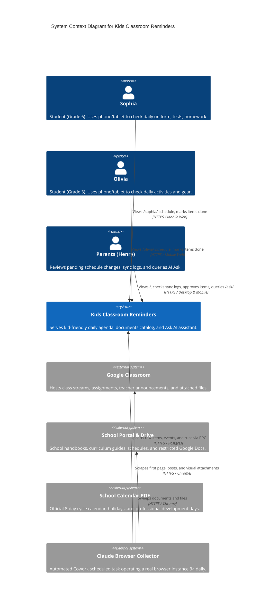
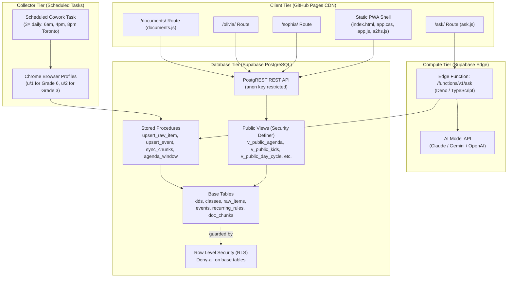
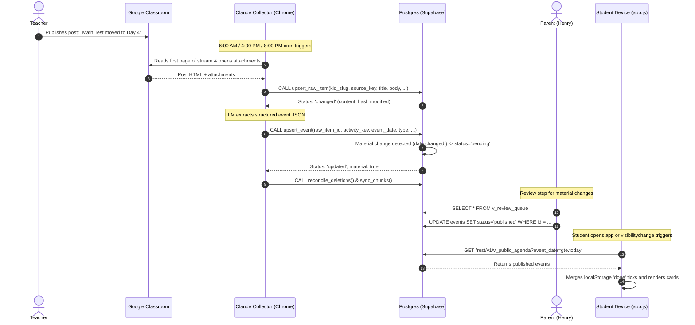
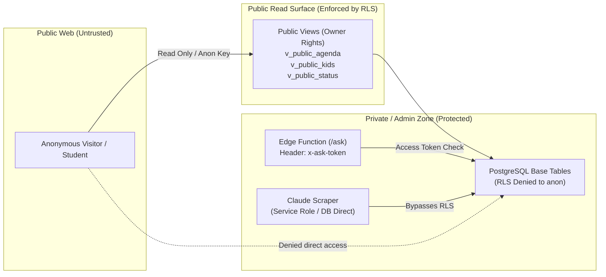

# System Architecture Design

Kids Classroom Reminders (*School Day*) is an event-driven, serverless daily schedule and semantic knowledge assistant. This document details the architectural topology, container model, component interactions, end-to-end data pipelines, and security boundaries.

---

## 1. System Context (C4 Level 1)

The system bridges unstructured educational sources (Google Classroom, portal handbooks, school calendar PDFs) and delivers high-fidelity, kid-accessible agendas and parent QA tools.

---

## 2. Container Architecture (C4 Level 2)

The system employs a strict separation of concerns:
- **Presentation Container**: Static, immutable assets hosted on GitHub Pages with zero server-side rendering or build steps.
- **Data & API Container (Supabase)**: Managed PostgreSQL hosting schema, triggers, business rules, and auto-generated PostgREST HTTP endpoints.
- **Edge Compute Container (Supabase Edge Functions)**: Secured runtime executing hybrid semantic search and LLM synthesis.
- **Ingestion Container (Claude in Chrome)**: Headless/scheduled browser executing DOM scraping, multimodal OCR, and stored procedure calls.

---

## 3. Core Component Architecture

### Frontend Subsystems
1. **Router & Kid Scoping (`app.js`)**:
   - Parses `location.pathname` (`/`, `/sophia`, `/olivia`).
   - Dynamically loads and filters the 21-day agenda horizon.
   - Manages CSS custom properties (`--accent`, `--accent-soft`) mapped to kid identity slugs.
2. **Add-to-Home-Screen Engine (`a2hs.js`)**:
   - Manages standalone PWA lifecycle across platforms (iOS Safari Share Sheet, Chrome/Edge `beforeinstallprompt`, macOS Safari 17+ Add to Dock).
   - Manages a 60-day snooze and suppresses banner once installed.
3. **Conversational Assistant (`ask/ask.js`)**:
   - Manages conversational thread and ephemeral turn state.
   - Intercepts client-side slash commands (`/clear`, `/new`, `/forget`, `/help`).
   - Communicates with the edge function passing device access token (`x-ask-token`).
4. **Document Registry (`documents/documents.js`)**:
   - Surfaces all scraped portal documents, extraction states, and target audiences.
   - Filters out-of-scope materials (Upper School, Grade 7+) by default.

### Database Subsystems
1. **Deduplication & Ingestion Triad**:
   - `raw_items`: Stores raw stream posts. Enforces uniqueness on `(kid_id, content_hash)`.
   - `upsert_raw_item()`: Calculates content hash, detects updates, archives historical revisions to `raw_item_versions`.
2. **Event Extraction & Materiality Detection**:
   - `events`: Stores individual calendar entries identified by `raw_item_id:activity_key`.
   - `upsert_event()`: Compares new attributes against existing events; if dates, times, or event types change, flags them as `material`, sets status to `pending`, and pushes to `v_review_queue`.
3. **Calendar & Day-Cycle Resolution**:
   - `day_cycle`: Holds the official school calendar mapping dates to Day 1–8 cycle numbers or closures (holidays, PD days).
   - `recurring_rules`: Expands timetable rules (e.g. Day 3 = Gym) into discrete events via `expand_recurring_rules()`.
4. **Semantic Chunker**:
   - `sync_chunks()`: Projects raw posts, extracted attachment texts, and school events into `doc_chunks` with `valid_from` and `valid_to` bounds, ready for vector embedding.

---

## 4. End-to-End Data Flow Sequence

The following diagram illustrates how a teacher posting in Google Classroom flows through the system to become an actionable card on a student's screen:

---

## 5. Trust Boundaries & Security Architecture

### Security Measures:
1. **Row Level Security (RLS) Denial**: All base tables (`kids`, `classes`, `raw_items`, `events`, `collection_runs`, etc.) have RLS enabled with zero anon policies. Direct table queries by the anonymous key yield zero rows.
2. **Restricted Public Projections**: Public views omit sensitive fields:
   - `kids.view_token` is never exposed.
   - `google_email`, student IDs, and private addresses are excluded.
   - Only `status = 'published'` and non-superseded events within `[-7, +120]` days are served.
3. **Isolated AI Query Endpoint (`/ask`)**:
   - The parent QA tool is gated behind an access token (`x-ask-token`) stored only in the parent device's `localStorage`.
   - The edge function validates this token before querying the database or issuing LLM requests.
4. **Prompt Injection Mitigation**:
   - Teacher posts and portal text are treated as untrusted user data.
   - Context is injected into LLM prompts wrapped strictly in `<context>...</context>` boundaries with explicit system instructions to ignore prompt overrides inside context.

---

## 6. Hosting & Deployment Topology

- **Domain**: `cal.studyflix.vip` pointing via CNAME to `candoit3721.github.io`.
- **Hosting**: GitHub Pages (served directly from the `main` branch root).
- **Zero-Build Architecture**: No Node.js build step, no Webpack/Vite bundle, and no package manager dependencies.
- **Cache Invalidation**: Automatic asset versioning handled by `.githooks/pre-commit`, hashing staged CSS/JS files and updating `?v=<hash>` query strings across all HTML entrypoints.
