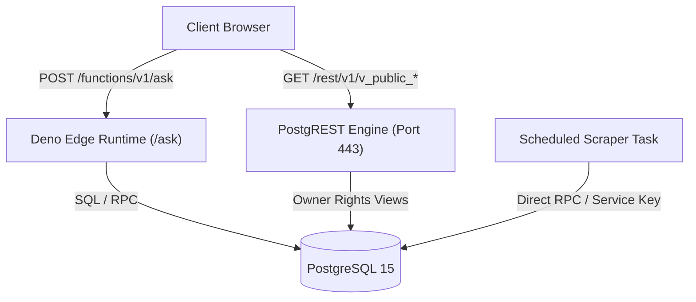
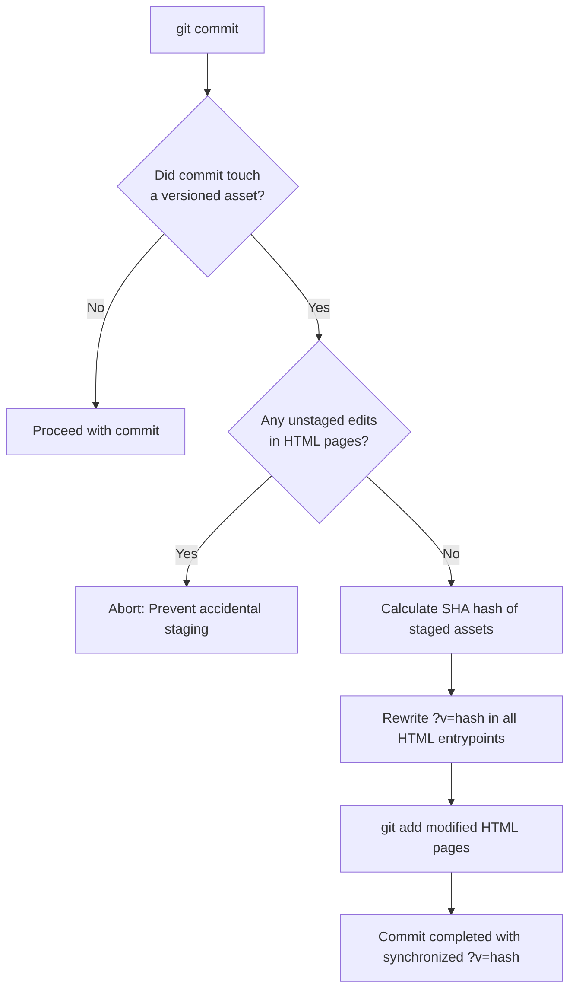

# Tech Stack & Design Philosophy

This document outlines the technologies selected for Kids Classroom Reminders, the technical rationale behind each decision, and the engineering principles guiding the system.

---

## 1. Technology Matrix

| Layer | Technology | Version / Spec | Purpose & Notes |
|---|---|---|---|
| **Frontend Runtime** | Vanilla JavaScript | ECMAScript 2022+ | Zero framework dependencies; asynchronous DOM manipulation and Fetch API. |
| **Frontend Styling** | Modern CSS3 | Custom Properties, Flexbox, Grid | Native theming, dark mode (`prefers-color-scheme`), dynamic CSS custom properties. |
| **Frontend PWA** | Web App Manifest + Service Worker | W3C PWA Specs | Full home-screen installability across iOS, Android, and macOS desktop. |
| **Storage & Database** | PostgreSQL via Supabase | PostgreSQL 15+ | Relational schema, array types (`int[]`), JSONB, and `pgcrypto` extension. |
| **Data API** | PostgREST | Supabase REST v1 | Auto-generated REST endpoints against database views using standard HTTP. |
| **Serverless Compute**| Supabase Edge Functions | Deno / TypeScript | Hosts conversational search endpoint (`/functions/v1/ask`) with token validation. |
| **Ingestion Engine** | Claude Cowork Scheduled Task | Chrome Browser Automation | Authenticated DOM scraping of Google Classroom streams and portal assets. |
| **Fallback Scraper**| Python 3 + Google APIs | Python 3.10+, `google-api-python-client` | OAuth desktop probe for direct Classroom API calls if domain allowlisted. |
| **Deployment / CDN** | GitHub Pages | Static Web Hosting | Git-driven zero-config deployment served from the `main` branch root. |
| **DNS & SSL** | GitHub Pages + Let's Encrypt | Custom CNAME (`cal.studyflix.vip`)| Dedicated subdomain certificate provisioning with enforced HTTPS. |
| **Build & Tooling** | Git Pre-Commit Hook | POSIX Shell + Perl + `shasum` | Deterministic asset content hashing for cache busting without a bundler. |

---

## 2. Engineering Philosophy & Principles

### 1. The Zero-Build Principle
Modern web development frequently suffers from dependency bloat, build tooling churn, and "dependency bitrot" where a project stops building after 18 months due to deprecated npm packages. 

**Kids Classroom Reminders rejects build tools entirely:**
- **No Node.js / npm**: No `package.json`, `node_modules`, or build scripts.
- **No Bundlers**: No Webpack, Vite, Rollup, or esbuild.
- **No Transpilation**: Modern browsers natively execute ES6+ syntax (async/await, template literals, optional chaining, nullish coalescing).
- **Direct GitHub Pages Serving**: Pushing to the `main` branch makes changes live in under 60 seconds without CI/CD pipeline lag.

### 2. Zero-Library Client Architecture
The frontend contains zero third-party JavaScript libraries:
- Fetching is performed via native `window.fetch()`.
- Date formatting uses native `Intl.DateTimeFormat` with explicit timezone targeting (`America/Toronto`).
- State is preserved using native `window.localStorage`.
- DOM manipulation utilizes small functional helpers (`$ = s => document.querySelector(s)`).

**Result:** The entire application payload is ~40 KB uncompressed across all CSS and JS files combined, delivering instant first-contentful paint (FCP < 300ms) even on low-powered school Wi-Fi or older iPads.

### 3. Native CSS Design System & Dark Mode
Rather than adopting Tailwind or CSS-in-JS, the application leverages native CSS custom properties (`--bg`, `--card`, `--ink`, `--accent`, `--k-violet`, `--k-teal`, etc.):

```css
:root {
  --bg: #f7f5f2;
  --card: #ffffff;
  --ink: #1c1a17;
  --accent: #5b21b6;
  --radius: 18px;
}

:root[data-kid="olivia"] { --accent: #0f766e; }
:root[data-kid="both"]   { --accent: #b45309; }

@media (prefers-color-scheme: dark) {
  :root {
    --bg: #141312;
    --card: #1e1c1a;
    --ink: #f2efea;
  }
}
```
- **Dynamic Theming**: Changing the displayed child automatically switches `--accent` and `--accent-soft` by toggling `document.documentElement.dataset.kid`.
- **Automatic Dark Mode**: Supported out of the box using media queries, maintaining kid color contrast ratios across both modes.

---

## 3. Progressive Web App (PWA) Implementation

Kids use iPads and phones, where home-screen icons are essential for friction-free access. However, mobile browser install APIs are notoriously fragmented.

### Custom PWA Architecture
1. **Pass-Through Service Worker (`sw.js`)**:
   ```javascript
   self.addEventListener("install", () => self.skipWaiting());
   self.addEventListener("activate", e => e.waitUntil(self.clients.claim()));
   self.addEventListener("fetch", () => { /* pass-through: deliberately caches nothing */ });
   ```
   *Rationale:* Web browsers require a registered service worker to qualify as an installable PWA on Android. By leaving `fetch` as a network pass-through, the app avoids stale cache pitfalls where critical school announcements could be hidden behind old cached code.

2. **Self-Managing Install Banner Engine (`a2hs.js`)**:
   Different operating systems require radically different installation flows:
   - **Chrome / Edge (Android & Desktop)**: Listens for `beforeinstallprompt`, prevents default, and renders a native "Add" button triggering `prompt()`.
   - **iOS Safari**: Browsers on iOS lack `beforeinstallprompt`. The banner detects iOS Safari and renders an interactive instructional card: *"Tap Share, then Add to Home Screen"*.
   - **iOS Chrome**: Detects Chrome on iOS and adapts instructions to point to the Share button beside the address bar.
   - **macOS Safari 17+**: Detects Safari on macOS and guides the user to *File → Add to Dock…*.
   - **Snoozing & Deduplication**: If dismissed, the banner stores a timestamp in `localStorage` and snoozes for 60 days. If launched from standalone mode (`display-mode: standalone` or `?src=a2hs`), it is permanently muted.

---

## 4. Backend & Database Technology: Supabase & PostgreSQL

Supabase provides the backend layer without requiring custom Node.js server maintenance:



### Why PostgreSQL + Supabase:
- **Array Types & Overlaps**: Fields like `recurring_rules.cycle_days int[]` permit native array storage (`'{1,4,7}'`) and query operators (`cycle_days @> ARRAY[3]`).
- **Cryptographic Hashing**: Uses `pgcrypto` (`sha256`) to create deterministic content hashes for posts and attachment bodies.
- **Row Level Security (RLS)**: Enforces security at the database kernel level rather than in application middleware.
- **PostgREST**: Eliminates boilerplate CRUD endpoints. The client queries views directly using query params (`?event_date=gte.2026-09-01&order=event_date`).

---

## 5. Cache Invalidation & Versioning Strategy

Because GitHub Pages serves static files verbatim with long cache headers, browser cache staleness is a critical risk.

### The Git Pre-Commit Fingerprinting Engine
Rather than running an external build tool, the project utilizes a tracked git pre-commit hook (`.githooks/pre-commit`):



**Assets Monitored**:
`a2hs.js`, `app.css`, `app.js`, `ask/ask.css`, `ask/ask.js`, `documents/documents.css`, `documents/documents.js`.

**HTML Entrypoints Updated**:
`index.html`, `sophia/index.html`, `olivia/index.html`, `ask/index.html`, `documents/index.html`.

Every visitor is guaranteed the latest assets immediately upon deployment, with zero build tooling required.
